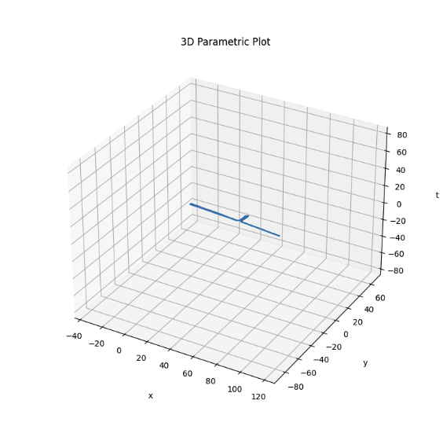

# ARCore-SLLTrajectoryEstimation-android
Use ARCore on Android to estimate trajectories.

Parsing Python Code to Java Code from AR Trajectory
> https://github.com/rfbr/PDR_with_Deep_Learning

Using Matrix Calculator com.sll.estimation.mat
> https://github.com/apacha/sensor-fusion-demo

* * *

The result value of the sample file is the route.txt file.

The column value for route consists of index (time), x, y, and z relative coordinates.

The root graph can be viewed as a plot library in python.

The image below is a graphical representation of route.txt.

* * *
input column
> index(time), qw, qx, qy, qz, tx, ty, tz
<pre><code>
//@see https://github.com/google-ar/arcore-android-sdk/tree/master/samples/hello_ar_java
@Override
public void onDrawFrame(SampleRender render) {
    Frame frame;
    try {
        frame = session.update(); 
    } catch (CameraNotAvailableException e) {
        Log.e(TAG, "Camera not available during onDrawFrame", e);
        return;
    }

    Camera camera = frame.getCamera();
    Pose cameraPose = camera.getDisplayOrientedPose();

    float[] translation = cameraPose.getTranslation();
    float[] rotationQuaternion = cameraPose.getRotationQuaternion();
    
    float qw = rotationQuaternion[3];
    float qx = rotationQuaternion[0];
    float qy = rotationQuaternion[1];
    float qz = rotationQuaternion[2];
    
    float tx = translation[0];
    float ty = translation[1];
    float tz = translation[2];
}
</code></pre>

result column
> index(time), x, y, z

x, y, z are relative coordinate.